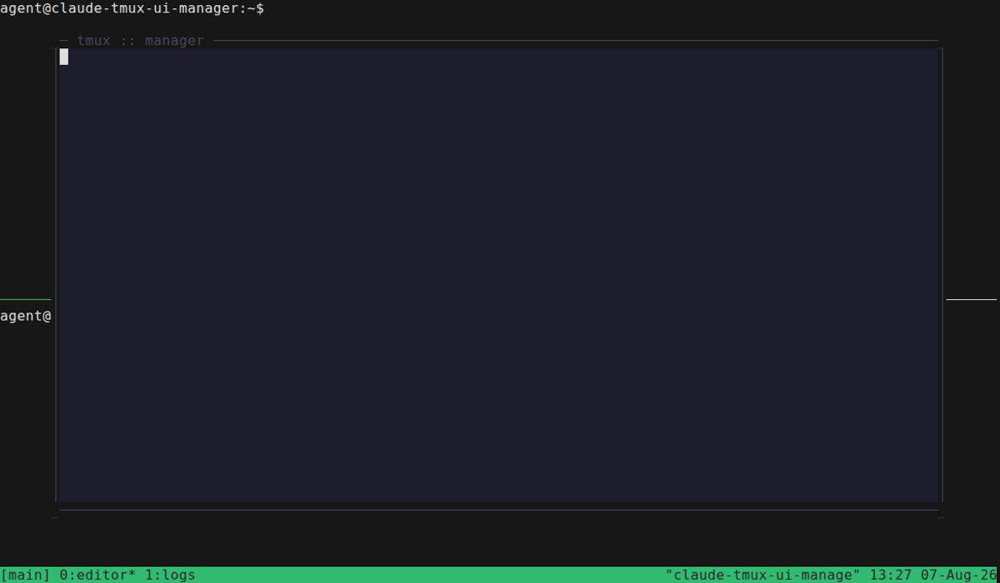

# tmux-ui-manager

[](https://github.com/binara-sachin/tmux-ui-manager/actions/workflows/ci.yml)
[](LICENSE)

An interactive, mouse-capable TUI for managing tmux sessions, windows, and panes — like `prefix+s` / `prefix+w`, but with full edit capabilities: rearrange, rename, kill, create, and drag-and-drop windows/panes between sessions.

Three linked Miller columns (**SESSIONS → WINDOWS → PANES**), Catppuccin Mocha themed, keyboard- and mouse-driven, opened as a tmux popup.



## Requirements

- tmux ≥ 3.2 (popup styling and a few niceties need ≥ 3.4 — the plugin detects this and adapts automatically)
- Rust toolchain (only needed to build the binary — see install below)
- [TPM](https://github.com/tmux-plugins/tpm) (or manual install)

## Install

### Via TPM

Add to `~/.tmux.conf`

```tmux
set -g @plugin 'binara-sachin/tmux-ui-manager'
```

Then `prefix + I` to install. TPM builds the binary automatically on first install (via `scripts/build.sh`); if `cargo` isn't on your `PATH`, tmux will show a message telling you to install Rust first (`brew install rust`, or [rustup.rs](https://rustup.rs)).

### Manual

```sh
git clone binara-sachin/tmux-ui-manager ~/.tmux/plugins/tmux-ui-manager
echo "run-shell ~/.tmux/plugins/tmux-ui-manager/manager.tmux" >> ~/.tmux.conf
tmux source ~/.tmux.conf
```

Or, if you already have this checked out locally (no separate clone needed), just point `run-shell` at wherever it lives on disk:

```tmux
run-shell /path/to/tmux-ui-manager/manager.tmux
```

## Usage

Default binding: `prefix + e` opens the popup. (Chosen so it never clobbers tmux's own `s`/`w` session/window pickers — see Options below if you'd rather bind something else.)

| Key | Action |
|---|---|
| ↑/↓, j/k | move selection in the focused column |
| ←/→, h/l, Tab/Shift-Tab | move focus between columns |
| Enter | attach/jump to the selected session/window/pane (closes the popup) |
| n | new: session column → new session · window column → new window · pane column → split pane |
| r | rename selected (pre-filled input) |
| x | kill selected (confirm overlay, unless `@manager-confirm-kill` is `off`) |
| z | zoom toggle (panes only) |
| Space or m | pick up the selected window/pane and enter move-mode |
| Esc, q | cancel the current overlay/drag/move-mode; quit if already idle |
| g / G | jump to top/bottom of the focused column |

Mouse: hover to highlight, click to select/focus, double-click to attach/jump, scroll wheel to scroll a column, click a `+ ...` row to create, drag a window/pane to move it (release on an invalid target, or off the columns entirely, cancels — nothing commits until you land somewhere valid).

## Options

All optional; set with `set -g <option> <value>` in `~/.tmux.conf`.

| Option | Default | Meaning |
|---|---|---|
| `@manager-key` | `e` | prefix key binding |
| `@manager-width` / `@manager-height` | `90%` / `85%` | popup size |
| `@manager-color-bg` | `#1e1e2e` | background |
| `@manager-color-text` | `#cdd6f4` | primary text |
| `@manager-color-meta` | `#a6adc8` | right-aligned/secondary text |
| `@manager-color-active` | `#a6e3a1` | attached-session/active-pane dot |
| `@manager-color-accent` | `#89b4fa` | drag/drop highlight |
| `@manager-color-danger` | `#f38ba8` | destructive actions, error toasts |
| `@manager-color-border` | `#45475a` | panel borders |
| `@manager-color-panel-title` | `#6c7086` | column title text |
| `@manager-color-selection-bg` | `#313244` | focused selection background |
| `@manager-confirm-kill` | `on` | set to `off` to skip the kill confirmation (power users only — there is no undo) |
